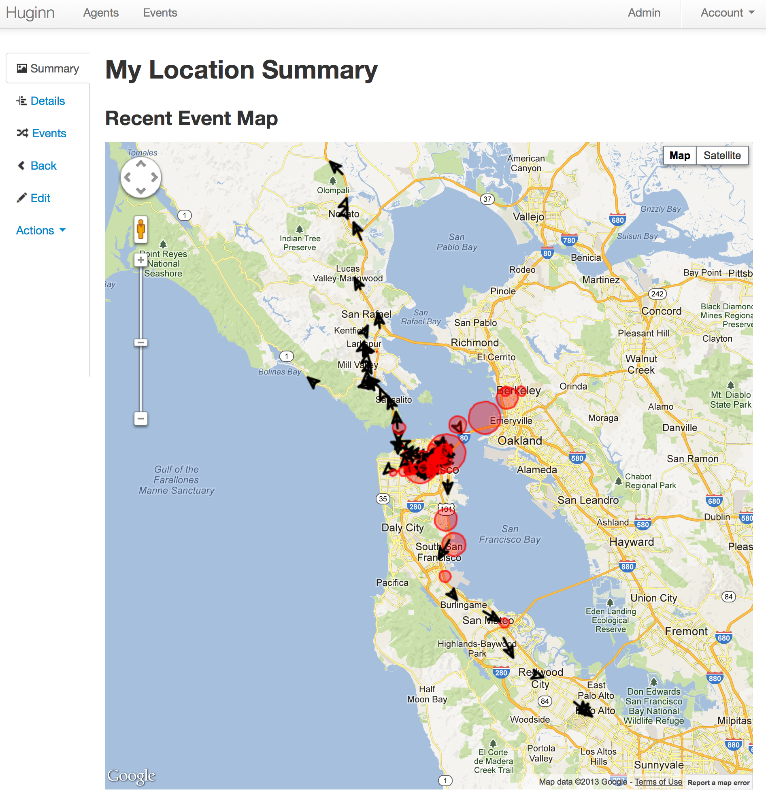
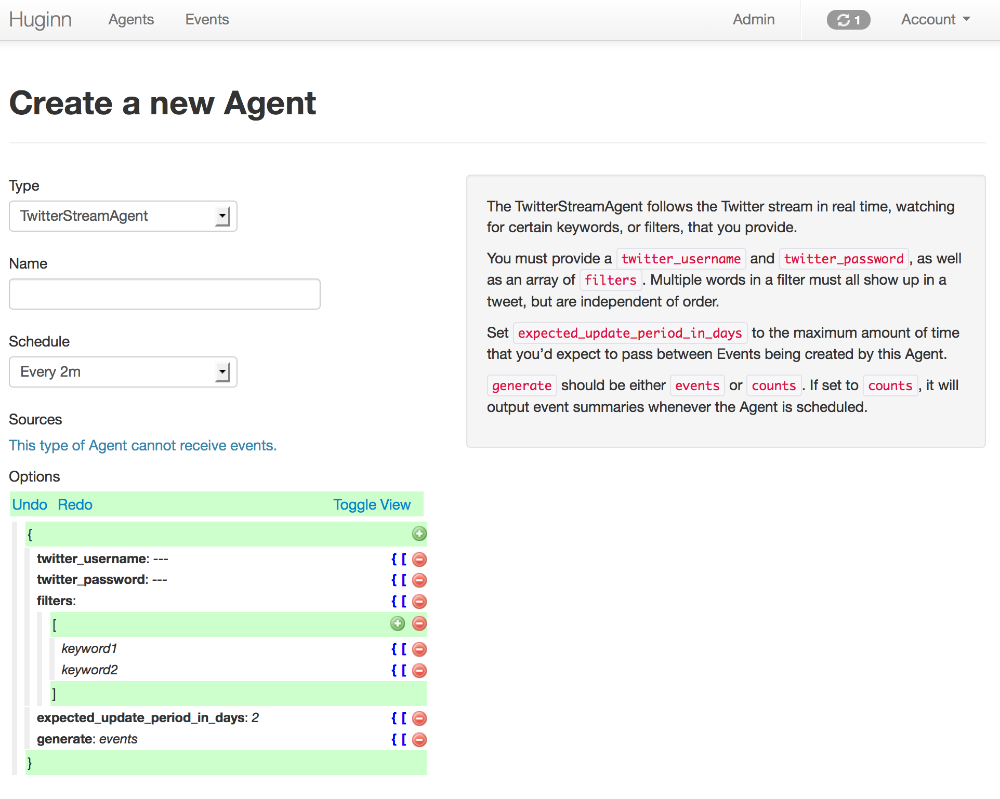

# Huginn.  Your agents are standing by.

## What is Huginn?

Huginn is a system for building agents that perform automated tasks for you online.  They can read the web, watch for events, and take actions on your behalf.  Huginn's Agents create and consume events.  It's a tool that makes it easy to monitor data sources and have actions take place when certain events occur.

#### We're just getting started, but here are some of the things that you can do right now with Huginn:

* Watch for air travel deals
* List terms you care about and receive emails when their occurrence on Twitter changes drastically
* Track the weather and get an email when it's going to rain (or snow) tomorrow
* Follow your project names on Twitter and get updates when people mention them
* Scrape websites and receive email when they change
* Track your location over time

You run Huginn on our own server, so you always know who has your data.  You do.

## Examples

And now, some example screenshots.  Below them are instructions to get you started.

## Getting Started

* Make a private fork of this repository on GitHub.
* In your fork, edit `config/secret_token.rb` and replace `REPLACE_ME_NOW!` with the output of `rake secret`.
* Edit `app/models/user.rb` and change the invitation code(s) in `INVITATION_CODES`.  This controls who can signup to use your installation.
* Run `rake db:create`, `rake db:migrate`, and then `rake db:seed` to create a development MySQL database with some example seed data.  Run `rails s`, visit `localhost:3000`, and login with the username of `admin` and the password of `password`.
* Make some extra Terminal windows and run `bundle exec rails runner bin/schedule.rb` and `bundle exec rails runner bin/twitter_stream.rb`

## Deployment

Deployment right now is configured with Capistrano, Unicorn, and nginx.  You should feel free to deploy in a different way, however.

### Required Setup

* Edit `app/mailers/system_mailer.rb` and set your default from address.
* Edit `config/unicorn/production.rb` and replace instances of *you* with the correct username for your server.
* Edit `config/environments/production.rb` and change the value of `DOMAIN` and the `config.action_mailer.smtp_settings` setup, which is currently setup for sending email through a Google Apps account on Gmail.
* Setup a place for Huginn to run.  I recommend making a dedicated user on your server for Huginn, but this is not required.  Setup nginx or Apache to proxy pass to unicorn.  There is an example nginx script in `config/nginx/production.conf`.
* Setup a production MySQL database for your installation.
* Edit `config/deploy.rb` and change all instances of `you` and `yourdomain` to the appropriate values for your server setup, then run `cap deploy:setup` followed by `cap deploy`.  If everything goes well, this should start some unicorn workers on your server to run the Huginn web app.
* After deploying with capistrano, SSH into your server, go to the deployment directory, and run `RAILS_ENV=production bundle exec rake db:seed` to generate your admin user.  Immediately login to your new Huginn installation with the username of `admin` and the password of `password` and change your email and password!
* You'll need to run bin/schedule.rb and bin/twitter_stream.rb in a daemonized way.  I've just been using screen sessions, but please contribute something better!

        RAILS_ENV=production bundle exec rails runner bin/schedule.rb
        RAILS_ENV=production bundle exec rails runner bin/twitter_stream.rb

### Optional Setup

#### Enable the WeatherAgent

In order to use the WeatherAgent you need an [API key with Wunderground](http://www.wunderground.com/weather/api/).  Signup for one and then put it in `app/models/agents/weather_agent.rb` in the `wunderground` method.

## Logging your location to the UserLocationAgent

You can use [Post Location](https://github.com/cantino/post_location) on your iPhone to post your location to an instance of the UserLocationAgent.  Make a new one to see instructions.

#### Enable DelayedJobWeb for handy delayed_job monitoring and control

* Edit `config.ru`, uncomment the DelayedJobWeb section, and change the DelayedJobWeb username and password.
* Uncomment `match "/delayed_job" => DelayedJobWeb, :anchor => false` in `config/routes.rb`.
* Uncomment `gem "delayed_job_web"` in Gemfile and run `bundle`.

#### Disable SSL

We assume your deployment will run over SSL. This is a very good idea! However, if you wish to turn this off, you'll probably need to edit `config/initializers/devise.rb` and modify the line containing `config.rememberable_options = { :secure => true }`.  You will also need to edit `config/environments/production.rb` and modify the value of `config.force_ssl`.

#### Setup Backups

Checkout `config/example_backup.rb` for an example script that you can use with the Backup gem.  If you want to use it, uncomment the associated lines in your Gemfile.

## License

Huginn is provided under the MIT License.

## Contribution

Please fork, add specs, and send pull requests!
