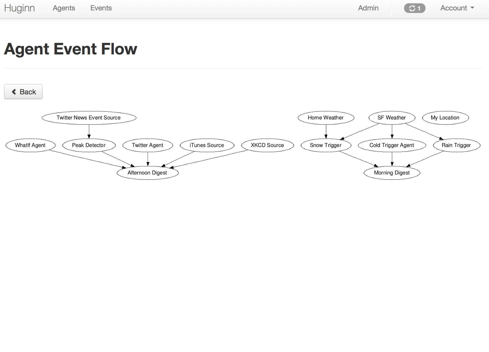
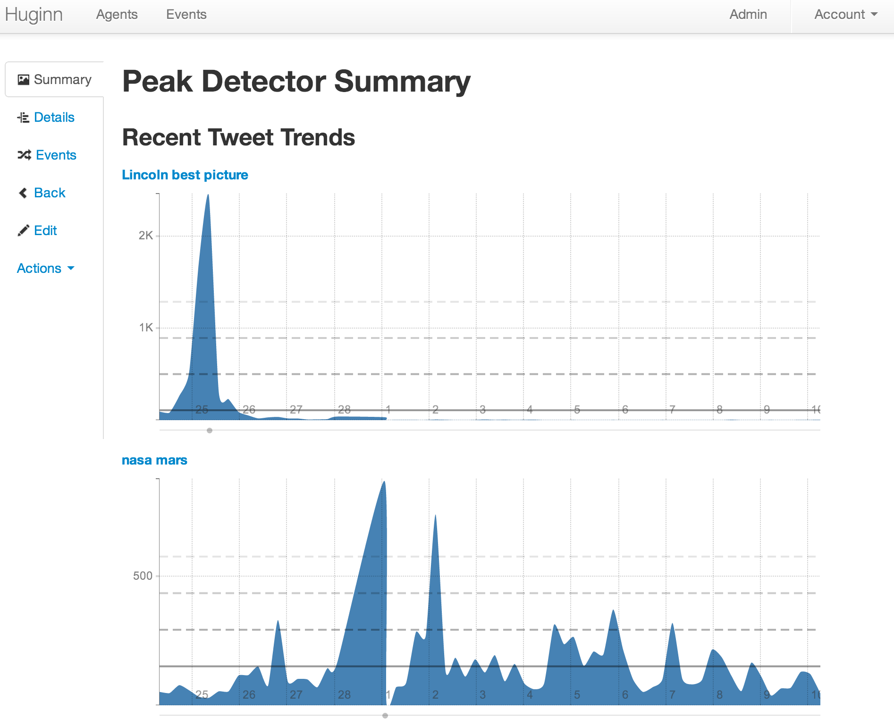

# Huginn.  Your agents are standing by.

## What is Huginn?

Huginn is a system for building agents that perform automated tasks for you online.  They can read the web, watch for events, and take actions on your behalf.  Huginn's Agents create and consume events, propagating events along a directed event flow graph.  Think of it as Yahoo! Pipes plus IFTTT on your own server.  You always know who has your data.  You do.

#### This is just getting started, but here are some of the things that you can do right now with Huginn:

* Watch for air travel deals
* List terms you care about and receive emails when their occurrence on Twitter changes drastically.  (For example, want to know when something interesting has happened in the world of Machine Learning?  Huginn will watch the term "machine learning" on Twitter and tell you when there is a large spike.)
* Track the weather and get an email when it's going to rain (or snow) tomorrow
* Follow your project names on Twitter and get updates when people mention them
* Scrape websites and receive emails when they change
* Compose digest emails about things you care about to be sent at specific times of the day
* Track counts of high frequency events and SMS on changes, such as the term "san francisco emergency"
* Watch public transit
* Run arbitrary JavaScript Agents on the server
* Track your location over time
* Create Amazon Mechanical Turk tasks as the input, or output, of events

Follow [@tectonic](https://twitter.com/tectonic) for updates as Huginn evolves, and join us in [our IRC channel](https://kiwiirc.com/client/irc.freenode.net/?nick=huginn-user|?#huginn) (\#huginn on Freenode) to discuss the project.

### We need your help!

Want to help with Huginn?  Try tackling [issues tagged with #help-wanted](https://github.com/cantino/huginn/issues?direction=desc&labels=help-wanted&page=1&sort=created&state=open).

## Examples

Please checkout the [Huginn Introductory Screencast](http://vimeo.com/61976251)!

And now, some example screenshots.  Below them are instructions to get you started.

## Getting Started

### Quick Start

If you just want to play around, you can simply clone this repository, then perform the following steps:

* Copy `.env.example` to `.env` (`cp .env.example .env`) and edit `.env`, at least updating the `APP_SECRET_TOKEN` variable.
* Run `rake db:create`, `rake db:migrate`, and then `rake db:seed` to create a development MySQL database with some example seed data.
* Run `foreman start`, visit [http://localhost:3000/][localhost], and login with the username of `admin` and the password of `password`.
* Setup some Agents!

Note: by default, emails are not sent in the `development` Rails environment, which is what you just setup.  If you'd like to enable emails when playing with Huginn locally, edit `config.action_mailer.perform_deliveries` in `config/environments/development.rb`.

If you need more detailed instructions, see the [Novice setup guide][novice-setup-guide].

[localhost]: http://localhost:3000/
[novice-setup-guide]: https://github.com/cantino/huginn/wiki/Novice-setup-guide

### Real Start

Follow these instructions if you wish to deploy your own version of Huginn or contribute back to the project.  GitHub doesn't make it easy to work with private forks of public repositories, so I recommend that you follow the following steps:

* Make a public fork of Huginn. If you can't create private Github repositories, you can skip the steps below. Just follow the *Quick Start* steps above and make pull requests when you want to contribute a patch. 
* Make a private, empty GitHub repository called `huginn-private`
* Duplicate your public fork into your new private repository (via [GitHub's instructions](https://help.github.com/articles/duplicating-a-repository)):

        git clone --bare git@github.com:you/huginn.git
        cd huginn.git
        git push --mirror git@github.com:you/huginn-private.git
        cd .. && rm -rf huginn.git

* Checkout your new private repository.
* Add your Huginn public fork as a remote to your new private repository (`huginn-private`):

        git remote add public git@github.com:you/huginn.git

* Run the steps from *Quick Start* above to configure your copy of Huginn.
* When you want to contribute patches, do a remote push from your private repository to your public fork of the relevant commits, then make a pull request to this repository.

## Deployment

Please see [the Huginn Wiki](https://github.com/cantino/huginn/wiki#deploying-huginn) for detailed deployment strategies for different providers.

### Optional Setup

#### Enable the WeatherAgent

In order to use the WeatherAgent you need an [API key with Wunderground](http://www.wunderground.com/weather/api/). Signup for one and then change value of `api_key: your-key` in your seeded WeatherAgent.

#### Logging your location to the UserLocationAgent

You can use [Post Location](https://github.com/cantino/post_location) on your iPhone to post your location to an instance of the UserLocationAgent.  Make a new one to see instructions.

#### Enable DelayedJobWeb for handy delayed\_job monitoring and control

* Edit `config.ru`, uncomment the DelayedJobWeb section, and change the DelayedJobWeb username and password.
* Uncomment `match "/delayed_job" => DelayedJobWeb, :anchor => false` in `config/routes.rb`.
* Uncomment `gem "delayed_job_web"` in Gemfile and run `bundle`.

#### Disable SSL

We assume your deployment will run over SSL. This is a very good idea! However, if you wish to turn this off, you'll probably need to edit `config/initializers/devise.rb` and modify the line containing `config.rememberable_options = { :secure => true }`.  You will also need to edit `config/environments/production.rb` and modify the value of `config.force_ssl`.

## License

Huginn is provided under the MIT License.

## Community
Huginn has its own IRC channel on freenode: #huginn.
Some of us are hanging out there, come and say hello.

## Contribution

Huginn is a work in progress and is hopefully just getting started.  Please get involved!  You can [add new Agents](https://github.com/cantino/huginn/wiki/Creating-a-new-agent), expand the [Wiki](https://github.com/cantino/huginn/wiki), or help us simplify and strengthen the Agent API or core application.

Please fork, add specs, and send pull requests!

  

