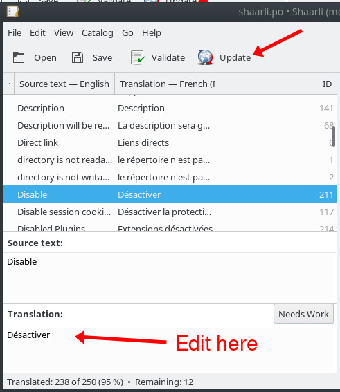

## Translations

Shaarli supports [gettext](https://www.gnu.org/software/gettext/manual/gettext.html) translations
since `>= v0.9.2`.

Note that only the `default` theme supports translations.

### Contributing

We encourage the community to contribute to Shaarli's translation either by improving existing
translations or submitting a new language.

Contributing to the translation does not require development skill.

Please submit a pull request with the `.po` file updated/created. Note that the compiled file (`.mo`)
is not stored on the repository, and is generated during the release process.

### How to

First, install [Poedit](https://poedit.net/) tool.

Poedit will extract strings to translate from the PHP source code.

**Important**: due to the usage of a template engine, it's important to generate PHP cache files to extract
every translatable string.

You can either use [this script](https://gist.github.com/ArthurHoaro/5d0323f758ab2401ef444a53f54e9a07)  (recommended)
or visit every template page in your browser to generate cache files, while logged in.

Here is a list :

```
http://<replace_domain>/
http://<replace_domain>/?nonope
http://<replace_domain>/?do=addlink
http://<replace_domain>/?do=changepasswd
http://<replace_domain>/?do=changetag
http://<replace_domain>/?do=configure
http://<replace_domain>/?do=tools
http://<replace_domain>/?do=daily
http://<replace_domain>/?post
http://<replace_domain>/?do=export
http://<replace_domain>/?do=import
http://<replace_domain>/login
http://<replace_domain>/picture-wall
http://<replace_domain>/?do=pluginadmin
http://<replace_domain>/?do=tagcloud
http://<replace_domain>/?do=taglist
```

#### Improve existing translation

In Poedit, click on "Edit a Translation", and from Shaarli's directory open
`inc/languages/<lang>/LC_MESSAGES/shaarli.po`.

The existing list of translatable strings should have been loaded, then click on the "Update" button.

You can start editing the translation.



Save when you're done, then you can submit a pull request containing the updated `shaarli.po`.

#### Add a new language

Open Poedit and select "Create New Translation", then from Shaarli's directory open
`inc/languages/<lang>/LC_MESSAGES/shaarli.po`.

Then select the language you want to create.

Click on `File > Save as...`, and save your file in `<shaarli directory>/inc/language/<new language>/LC_MESSAGES/shaarli.po`.
`<new language>` here should be the language code respecting the [ISO 3166-1 alpha-2](https://en.wikipedia.org/wiki/ISO_3166-2)
format in lowercase (e.g. `de` for German).

Then click on the "Update" button, and you can start to translate every available string.

Save when you're done, then you can submit a pull request containing the new `shaarli.po`.

### Theme translations

Theme translation extensions are loaded automatically if they're present.

As a theme developer, all you have to do is to add the `.po` and `.mo` compiled file like this:

    tpl/<theme name>/language/<lang>/LC_MESSAGES/<theme name>.po
    tpl/<theme name>/language/<lang>/LC_MESSAGES/<theme name>.mo

Where `<lang>` is the ISO 3166-1 alpha-2 language code.
Read the following section "Extend Shaarli's translation" to learn how to generate those files.

### Extend Shaarli's translation

If you're writing a custom theme, or a non official plugin, you might want to use the translation system,
but you won't be able to able to override Shaarli's translation.

However, you can add your own translation domain which extends the main translation list.

> Note that you can find a live example of translation extension in the `demo_plugin`.

First, create your translation files tree directory:

```
<your_module>/languages/<ISO 3166-1 alpha-2 language code>/LC_MESSAGES/
```

Your `.po` files must be named like your domain. E.g. if your translation domain is `my_theme`, then your file will be
`my_theme.po`.

Users have to register your extension in their configuration with the parameter
`translation.extensions.<domain>: <translation files path>`.

Example:

```php
if (! $conf->exists('translation.extensions.my_theme')) {
    $conf->set('translation.extensions.my_theme', '<your_module>/languages/');
    $conf->write(true);
}
```

> Note that the page needs to be reloaded after the registration.

It is then recommended to create a custom translation function which will call the `t()` function with your domain.
For example :

```php
function my_theme_t($text, $nText = '', $nb = 1)
{
    return t($text, $nText, $nb, 'my_theme'); // the last parameter is your translation domain.
}
```

All strings which can be translated should be processed through your function:

```php
my_theme_t('Comment');
my_theme_t('Comment', 'Comments', 2);
```

Or in templates:

```php
{'Comment'|my_theme_t}
{function="my_theme_t('Comment', 'Comments', 2)"}
```

> Note than in template, you need to visit your page at least once to generate a cache file.

When you're done, open Poedit and load translation strings from sources:

  1. `File > New`
  2. Choose your language
  3. Save your `PO` file in `<your_module>/languages/<language code>/LC_MESSAGES/my_theme.po`.
  4. Go to `Catalog > Properties...`
  5. Fill the `Translation Properties` tab
  6. Add your source path in the `Sources Paths` tab
  7. In the `Sources Keywords` tab uncheck "Also use default keywords" and add the following lines:

```
my_theme_t
my_theme_t:1,2
```

Click on the "Update" button and you're free to start your translations!
